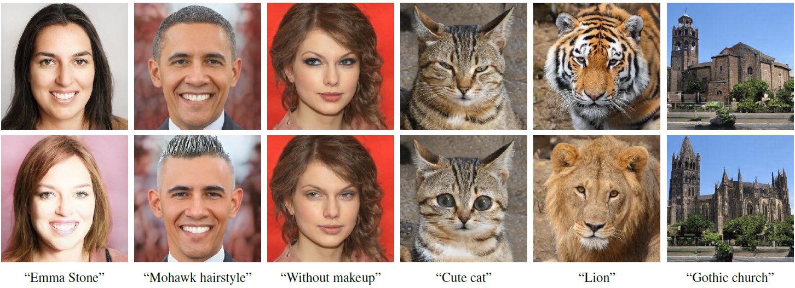
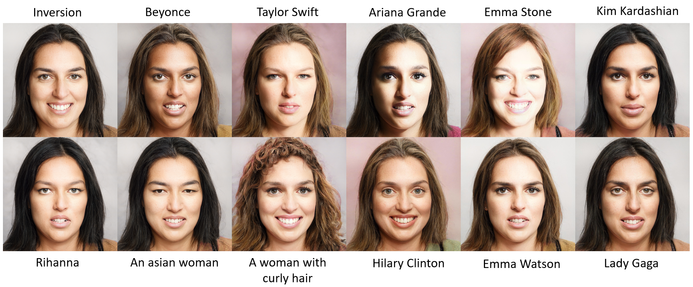
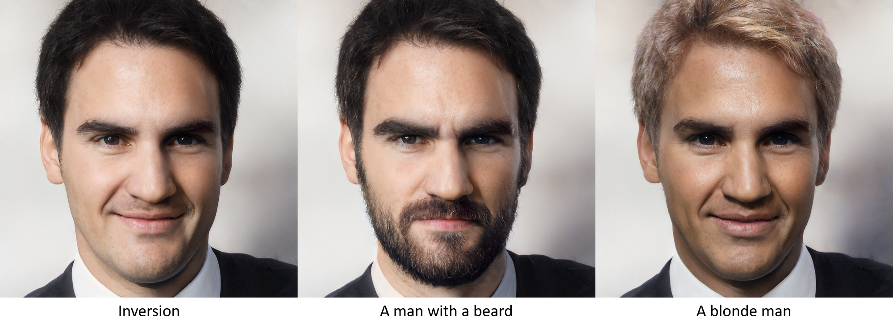
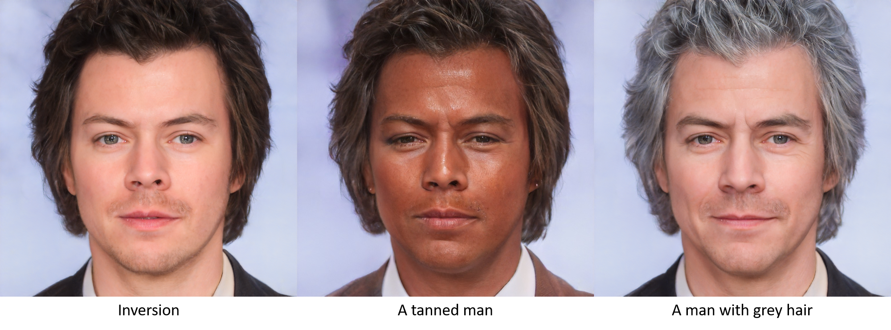
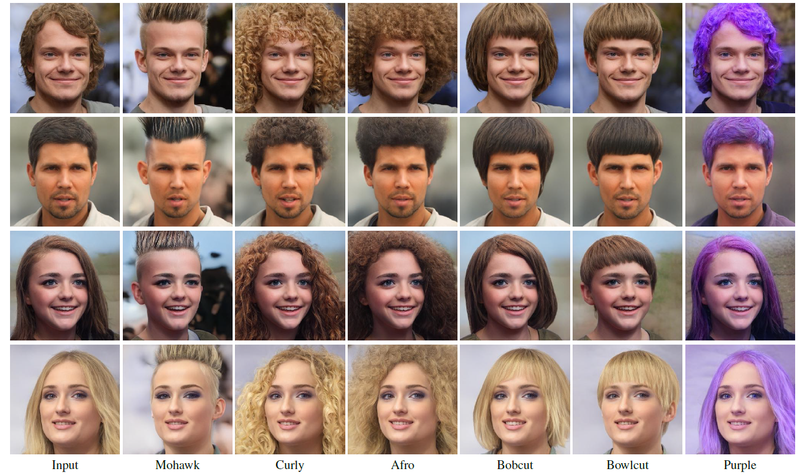
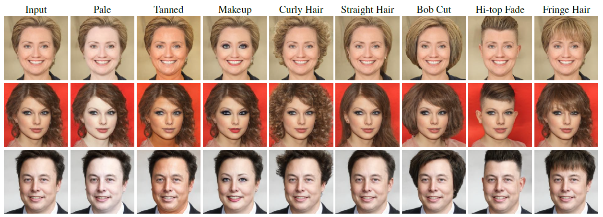
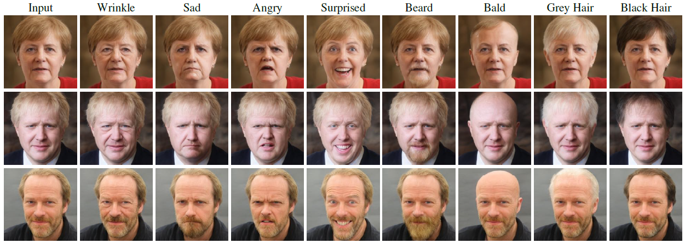

# StyleCLIP: Text-Driven Manipulation of StyleGAN Imagery
[](http://colab.research.google.com/github/orpatashnik/StyleCLIP/blob/main/playground.ipynb)
<a href="https://www.youtube.com/watch?v=5icI0NgALnQ"></a>



> **StyleCLIP: Text-Driven Manipulation of StyleGAN Imagery**<br>
> Or Patashnik*, Zongze Wu*, Eli Shechtman, Daniel Cohen-Or, Dani Lischinski <br>
> *Equal contribution, ordered alphabetically <br>
> https://arxiv.org/abs/2103.17249 <br>
>
>**Abstract:** Inspired by the ability of StyleGAN to generate highly realistic
images in a variety of domains, much recent work has
focused on understanding how to use the latent spaces of
StyleGAN to manipulate generated and real images. However,
discovering semantically meaningful latent manipulations
typically involves painstaking human examination of
the many degrees of freedom, or an annotated collection
of images for each desired manipulation. In this work, we
explore leveraging the power of recently introduced Contrastive
Language-Image Pre-training (CLIP) models in order
to develop a text-based interface for StyleGAN image
manipulation that does not require such manual effort. We
first introduce an optimization scheme that utilizes a CLIP-based
loss to modify an input latent vector in response to a
user-provided text prompt. Next, we describe a latent mapper
that infers a text-guided latent manipulation step for
a given input image, allowing faster and more stable textbased
manipulation. Finally, we present a method for mapping
a text prompts to input-agnostic directions in StyleGAN’s
style space, enabling interactive text-driven image
manipulation. Extensive results and comparisons demonstrate
the effectiveness of our approaches.


## Description
Official Implementation of StyleCLIP, a method to manipulate images using a driving text. 
Our method uses the generative power of a pretrained StyleGAN generator, and the visual-language power of CLIP.
In the paper we present three methods: 
- Latent vector optimization.
- Latent mapper, trained to manipulate latent vectors according to a specific text description.
- Global directions in the StyleSpace.

Currently the repository contains the code for the optimization only. 
The code for the latent mapper and for the global directions will be released soon - stay tuned!

## Updates
**31/3/2021** Upload paper to arxiv, and video to YouTube

**14/2/2021** Initial version

## Editing Examples

In the following, we show some results obtained with our methods. 
All images are real, and were inverted into the StyleGAN's latent space using [e4e](https://github.com/omertov/encoder4editing). 
The driving text that was used for each edit appears below or above each image.

#### Latent Optimization






#### Latent Mapper



#### Global Directions





## Editing via Latent Vector Optimization

### Setup

The code relies on the official implementation of [CLIP](https://github.com/openai/CLIP), 
and the [Rosinality](https://github.com/rosinality/stylegan2-pytorch/) pytorch implementation of StyleGAN2.
Some parts of the StyleGAN implementation were modified, so that the whole implementation is native pytorch.

#### Requirements
- Anaconda
- Pretrained StyleGAN2 generator (can be downloaded from [here](https://drive.google.com/file/d/1EM87UquaoQmk17Q8d5kYIAHqu0dkYqdT/view?usp=sharing))

In addition, run the following commands:
  ```shell script
conda install --yes -c pytorch pytorch=1.7.1 torchvision cudatoolkit=<CUDA_VERSION>
pip install ftfy regex tqdm
pip install git+https://github.com/openai/CLIP.git
```

### Usage

Given a textual description, one can both edit a given image, or generate a random image that best fits to the description.
Both operations can be done through the `main.py` script, or the notebook.

#### Editing
To edit an image set `--mode=edit`. Editing can be done on both provided latent vector, and on a random latent vector from StyleGAN's latent space.
It is recommended to adjust the `--l2_lambda` according to the desired edit. 

#### Generating Free-style Images
To generate a free-style image set `--mode=free_generation`.


## Editing via Global Direction
[](https://colab.research.google.com/github/orpatashnik/StyleCLIP/blob/main/StyleCLIP_global.ipynb)
  ```shell script

cd global

# input dataset name 
dataset_name='ffhq' # input dataset name, currently, only support ffhq

# input prepare data 
python GetCode.py --dataset_name $dataset_name --code_type 'w'
python GetCode.py --dataset_name $dataset_name --code_type 's'
python GetCode.py --dataset_name $dataset_name --code_type 's_mean_std'

# interactively manipulation 
python RetrievalAPP.py --dataset_name $dataset_name
```

### parameters and tips 
**neutral text**: 'a photo of a' + custom input  (please press enter after you modify the text)
**target text**: 'a photo of a' + custom input   (please press enter after you modify the text)

The attribute is controlled by (neutral, target) pairs: smile (face, smiling face), gender (female face, male face), blond hair (face with hair, face with blond hair), Hi-top fade (face with hair, face with Hi-top fade hair), blue eyes (face with eyes, face with blue eyes). More examples could be found in this [video](https://www.youtube.com/watch?v=5icI0NgALnQ). 

**manipulation strength**: positive value means moving the image toward target direction. 

**disentanglement threshold**: large value means more disentangle, just a few channels will be manipulated, only the target attribute will change (for example, grey hair). Small value means less disentangle, a large number of channels will be manipulated, related attributes will also change (such as wrinkle, skin color, glasses). 

**Pratice tips**: In terminal, for every manipulation, we will print the number of channel being manipulated, which is controled by attribue (neutral, target) and disentanglement threshold.

1. For color transformation, usually 10-20 channels is enough. For large structure change (for example, Hi-top fade), usually 100-200 channels are required.
2. For an attribute (neutral, target), if you give a low disentanglement threshold, there are just a few channels (<20) being manipulated, usually it implies that this attribute could not be manipulated through our global method.


## Related Works

The global directions we find for editing are direction in the _S Space_, which was introduced and analyzed in [StyleSpace](https://arxiv.org/abs/2011.12799) (Wu et al).

To edit real images, we inverted them to the StyleGAN's latent space using [e4e](https://arxiv.org/abs/2102.02766) (Tov et al.). 

## Citation

If you use this code for your research, please cite our paper:

```
@misc{patashnik2021styleclip,
      title={StyleCLIP: Text-Driven Manipulation of StyleGAN Imagery}, 
      author={Or Patashnik and Zongze Wu and Eli Shechtman and Daniel Cohen-Or and Dani Lischinski},
      year={2021},
      eprint={2103.17249},
      archivePrefix={arXiv},
      primaryClass={cs.CV}
}
```
